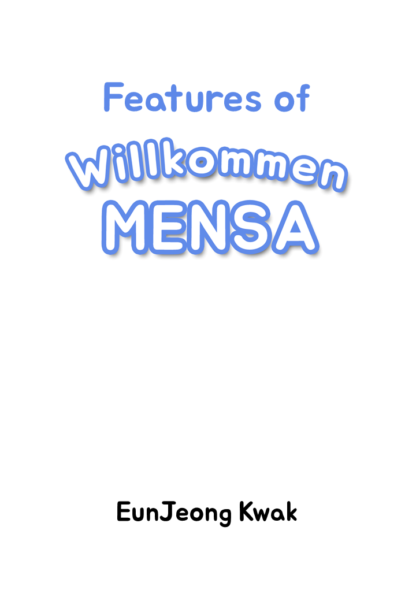
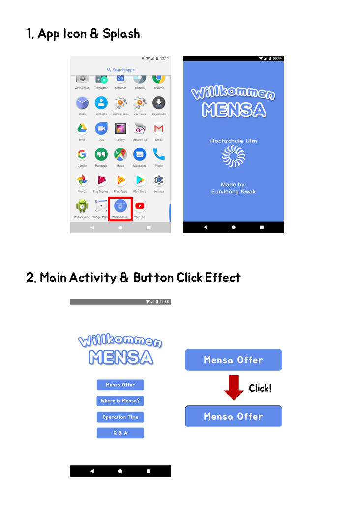
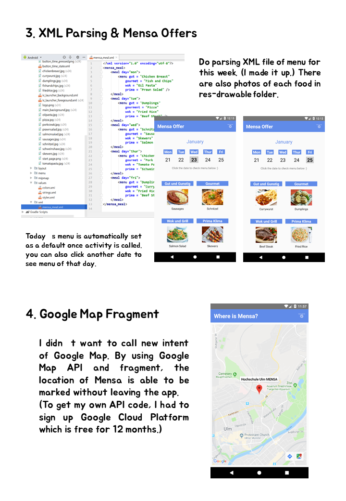
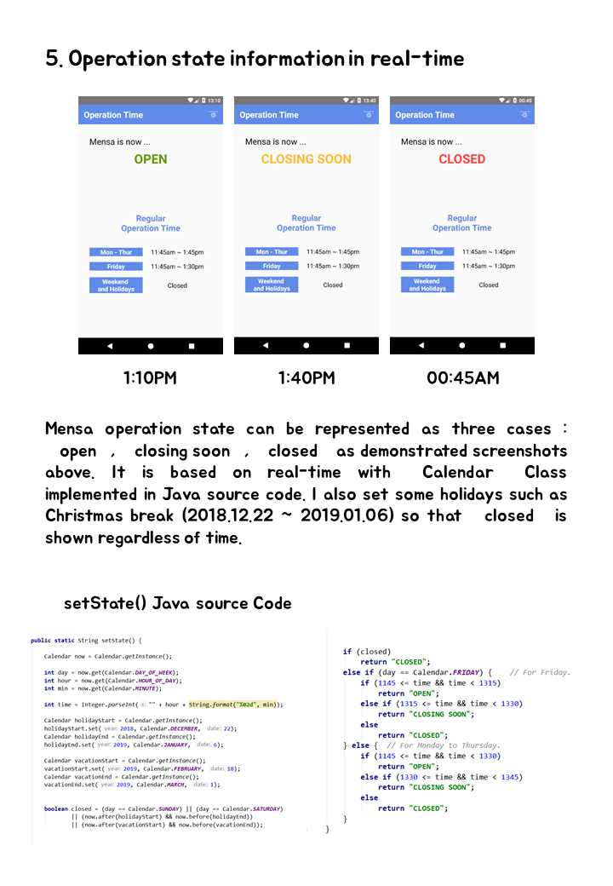
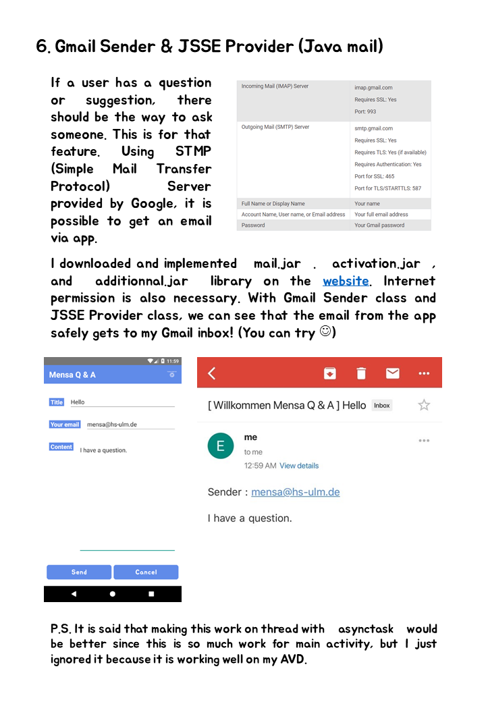
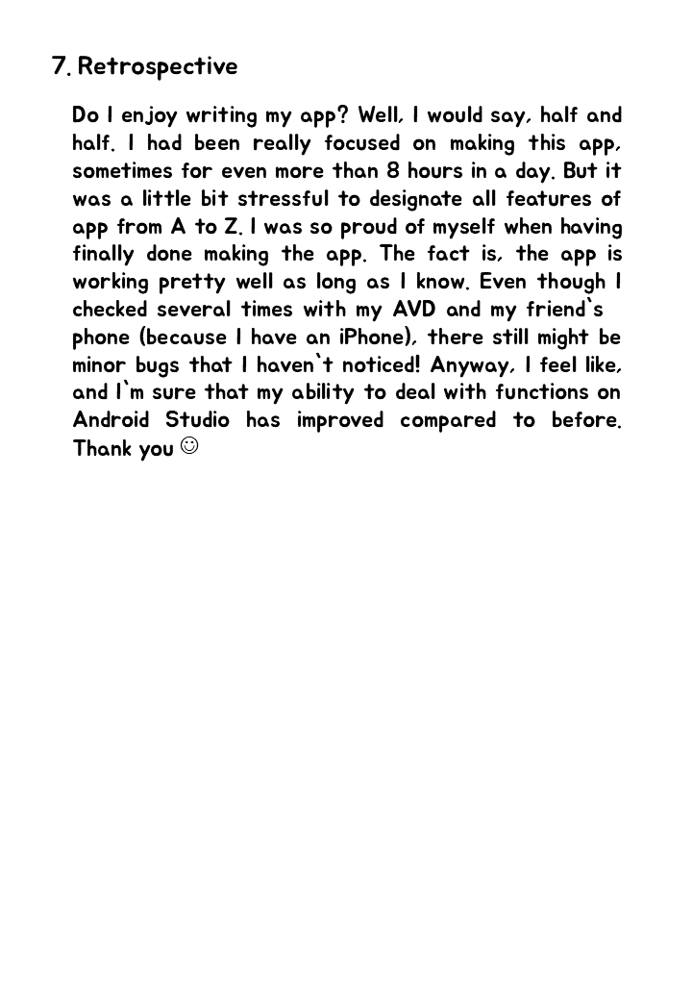

<h1 align="center">Willkommen Mensa</h1>

  

> Hochschule Ulm 2018 Winter Semester 
> Final Project of Mobile Application Development (MAD)
> 
> The app for Hochschule Ulm students and school personnels.

 

## Install

Download `./app/release/willkommen-mensa.apk` on your Android smartphone.

 

## Author

👤 **EunJeong Kwak**

* Website: http://eun-jeong.tistory.com
* Github: [@iamkkwak](https://github.com/iamkkwak)

## Show your support

Give a ⭐️ if this project helped you!

***
_This README was generated with ❤️ by [readme-md-generator](https://github.com/kefranabg/readme-md-generator)_
